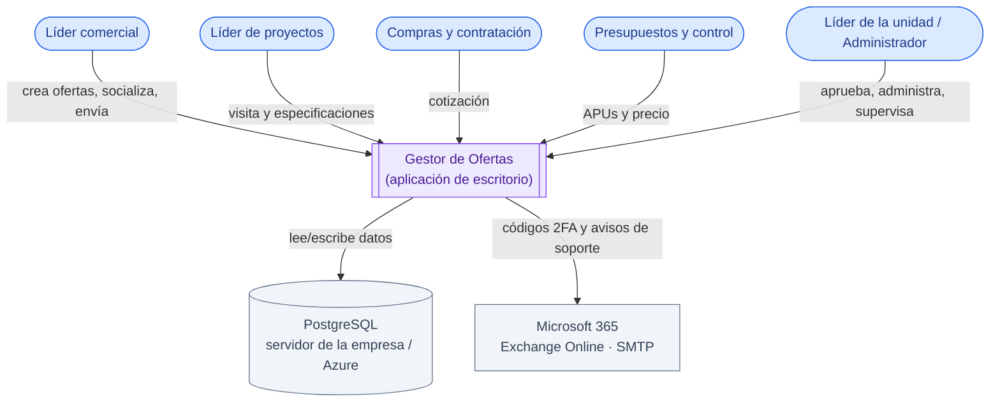
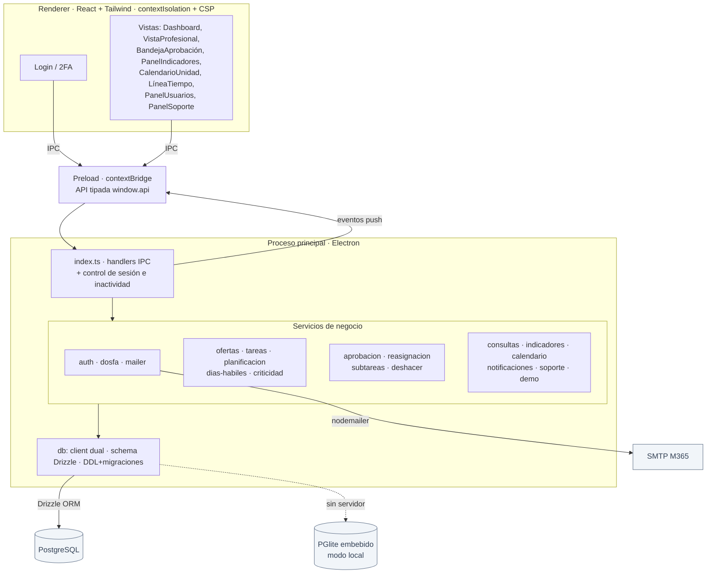
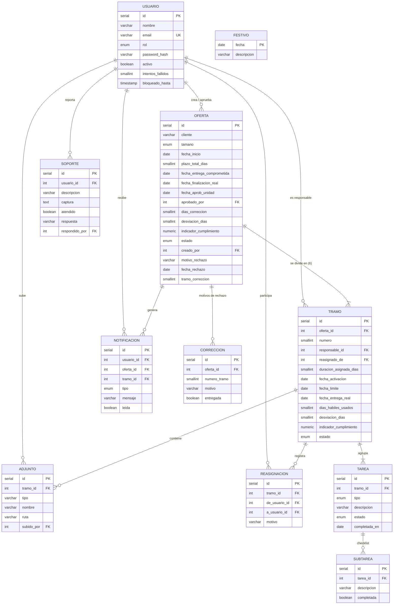
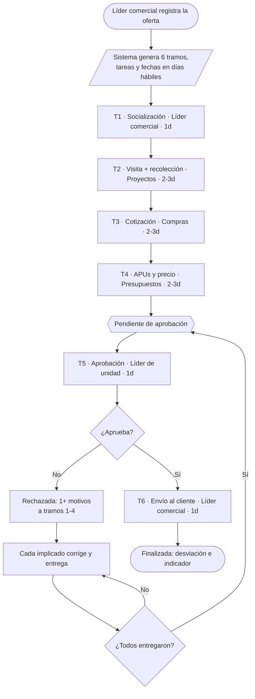
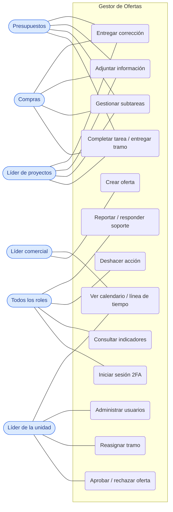
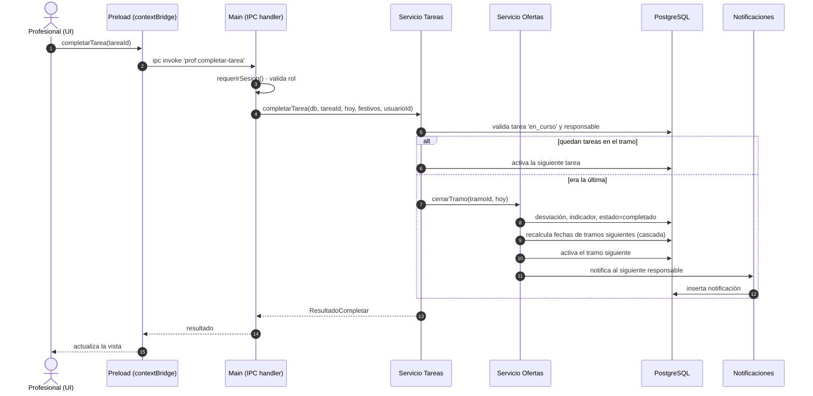
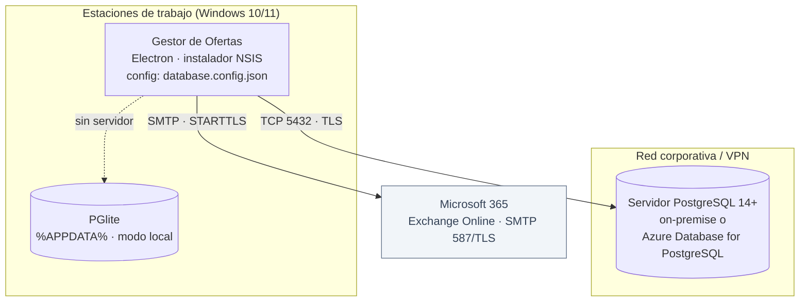

# Documento de Diseño Técnico — Gestor de Ofertas

**Versión:** 0.1.0 · **Tipo:** aplicación de escritorio (Electron) · multiusuario sobre PostgreSQL.
Documento solicitado por el Departamento de Tecnología. Los diagramas están en
**Mermaid** (se renderizan en VS Code, GitHub, Azure DevOps Wiki, mermaid.live o draw.io).

Índice:
1. Diagrama de contexto
2. Diagrama de arquitectura / componentes
3. Diagrama entidad–relación (DER)
4. Diagrama de flujo de procesos
5. Casos de uso
6. Diagrama de secuencia
7. Diagrama de despliegue
8. Diccionario de datos
9. Especificación de la API (IPC)

---

## 1. Diagrama de contexto

Visión general: quién usa el sistema y de qué servicios externos depende.

---

## 2. Diagrama de arquitectura / componentes

Aplicación Electron con tres capas de proceso. **Toda la lógica de negocio y la
autorización viven en el proceso principal**; la interfaz solo consume una API
tipada expuesta por `contextBridge`.

**Principios:** sin módulos nativos a compilar; consultas parametrizadas vía
ORM; sesión y permisos validados en el backend en cada operación; el renderer no
accede a Node.js.

---

## 3. Diagrama entidad–relación (DER)

Modelo de datos real (PostgreSQL). Incluye las extensiones al esquema original:
`subtarea`, `correccion`, `soporte` y columnas de rechazo/seguridad.

---

## 4. Diagrama de flujo de procesos

Lógica funcional principal: ciclo de vida de una oferta (6 tramos secuenciales).

> Detalle ampliado y código de colores en `FLUJOGRAMA.md` /
> `flujograma_ciclo_vida.pdf`.

---

## 5. Casos de uso

Interacción de cada rol con el sistema.

---

## 6. Diagrama de secuencia

Operación representativa: **un profesional completa la última tarea de su
tramo** (cierre, medición, recálculo en cascada y notificación).

---

## 7. Diagrama de despliegue

Dónde vive y se ejecuta la aplicación.

**Notas de despliegue:** la app se instala por equipo (no requiere admin). La
conexión a la base y el SMTP se configuran por equipo en
`%APPDATA%\gestor-ofertas\database.config.json` (no se incrustan en el
instalador). Sin ese archivo, cada equipo opera de forma aislada con PGlite.

---

## 8. Diccionario de datos

Tipos enumerados:

| Enum | Valores |
|---|---|
| `rol_usuario` | lider_comercial, lider_proyectos, compras_contratacion, presupuestos_control, lider_unidad |
| `tamano_oferta` | grande (9 días), pequena (6 días) |
| `estado_oferta` | en_curso, pendiente_aprobacion_final, aprobada, rechazada |
| `tipo_tarea` | socializacion, visita, recoleccion, cotizacion, apu, aprobacion_unidad, envio_cliente |
| `estado_tarea` | pendiente, en_curso, completada, vencida |
| `estado_tramo` | pendiente, en_curso, completado, vencido |
| `tipo_notificacion` | compromiso, vencimiento_proximo, retraso |

**usuario** — personas que acceden al sistema.

| Campo | Tipo | Descripción |
|---|---|---|
| id | serial PK | Identificador |
| nombre | varchar(150) | Nombre completo |
| email | varchar(150) UK | Correo (login); ideal el de Microsoft 365 |
| rol | rol_usuario | Perfil / permisos |
| password_hash | varchar(255) | Hash bcrypt (nunca texto plano) |
| activo | boolean | Si puede iniciar sesión |
| intentos_fallidos | smallint | Contador para el bloqueo |
| bloqueado_hasta | timestamp | Fin del bloqueo temporal (si aplica) |
| creado_en | timestamp | Alta del registro |

**festivo** — calendario nacional para el cálculo de días hábiles.

| Campo | Tipo | Descripción |
|---|---|---|
| fecha | date PK | Día festivo |
| descripcion | varchar(150) | Nombre del festivo |

**oferta** — actividad principal.

| Campo | Tipo | Descripción |
|---|---|---|
| id | serial PK | Identificador |
| cliente | varchar(200) | Cliente |
| tamano | tamano_oferta | Grande / pequeña |
| fecha_inicio | date | Inicio (día hábil) |
| plazo_total_dias | smallint | 9 o 6 (plazo técnico) |
| fecha_entrega_comprometida | date | Fecha prometida al cliente (límite del envío) |
| fecha_finalizacion_real | date | Fecha real de envío al cliente |
| fecha_aprob_unidad | date | Fecha de aprobación |
| aprobado_por | int FK→usuario | Quién aprobó |
| dias_correccion | smallint | Días por rechazos (contados aparte, RN-19) |
| desviacion_dias | smallint | + retraso / − adelanto (días hábiles) |
| indicador_cumplimiento | numeric(5,2) | % de cumplimiento de la oferta |
| estado | estado_oferta | Estado actual |
| creado_por | int FK→usuario | Quién la registró (comercial) |
| motivo_rechazo | varchar(255) | Resumen del último rechazo |
| fecha_rechazo | date | Fecha del rechazo vigente |
| tramo_correccion | smallint | (heredado) compatibilidad |

**tramo** — unidad de plazo y calificación (6 por oferta).

| Campo | Tipo | Descripción |
|---|---|---|
| id | serial PK | Identificador |
| oferta_id | int FK→oferta | Oferta |
| numero | smallint (1–6) | Posición en el flujo |
| responsable_id | int FK→usuario | Profesional asignado |
| reasignado_de | int FK→usuario | Titular original si hubo reasignación |
| duracion_asignada_dias | smallint | Días hábiles asignados |
| fecha_activacion | date | Cuando recibe el trabajo |
| fecha_limite | date | Fecha límite |
| fecha_entrega_real | date | Entrega real |
| dias_habiles_usados | smallint | Días hábiles consumidos |
| desviacion_dias | smallint | usados − asignados |
| indicador_cumplimiento | numeric(5,2) | % del tramo |
| estado | estado_tramo | Estado |

**tarea** — pasos de un tramo. **subtarea** — checklist personal dentro de una tarea.

| tarea | Tipo | Descripción |
|---|---|---|
| id | serial PK | Identificador |
| tramo_id | int FK→tramo | Tramo |
| tipo | tipo_tarea | Tipo de tarea |
| descripcion | varchar(255) | Texto |
| estado | estado_tarea | Estado |
| completada_en | date | Fecha de completado |

| subtarea | Tipo | Descripción |
|---|---|---|
| id | serial PK | Identificador |
| tarea_id | int FK→tarea | Tarea |
| descripcion | varchar(255) | Ítem del checklist |
| completada | boolean | Cumplida o no |

**adjunto** — archivos compartidos por tramo. **reasignacion** — bitácora de reasignaciones.

| adjunto | Tipo | Descripción |
|---|---|---|
| id | serial PK | Identificador |
| tramo_id | int FK→tramo | Tramo |
| tipo | varchar(50) | especificaciones, cotizacion… |
| nombre | varchar(255) | Nombre del archivo |
| ruta | varchar(500) | Ruta/URL |
| subido_por | int FK→usuario | Autor |

| reasignacion | Tipo | Descripción |
|---|---|---|
| id | serial PK | Identificador |
| tramo_id | int FK→tramo | Tramo reasignado |
| de_usuario_id | int FK→usuario | Titular anterior |
| a_usuario_id | int FK→usuario | Nuevo responsable |
| motivo | varchar(255) | Motivo |

**correccion** — motivos de rechazo (varios por oferta). **soporte** — reportes técnicos.

| correccion | Tipo | Descripción |
|---|---|---|
| id | serial PK | Identificador |
| oferta_id | int FK→oferta | Oferta rechazada |
| numero_tramo | smallint | Tramo a corregir (1–4) |
| motivo | varchar(500) | Causa puntual |
| entregada | boolean | Si el profesional ya corrigió |

| soporte | Tipo | Descripción |
|---|---|---|
| id | serial PK | Identificador |
| usuario_id | int FK→usuario | Quién reporta |
| descripcion | varchar(2000) | Problema |
| captura | text | Pantallazo (data URL base64) |
| atendido | boolean | Estado |
| respuesta | varchar(2000) | Respuesta del administrador |
| respondido_por | int FK→usuario | Quién respondió |

**notificacion** — avisos en la app.

| Campo | Tipo | Descripción |
|---|---|---|
| id | serial PK | Identificador |
| usuario_id | int FK→usuario | Destinatario |
| oferta_id | int FK→oferta | Oferta relacionada (opcional) |
| tramo_id | int FK→tramo | Tramo relacionado (opcional) |
| tipo | tipo_notificacion | compromiso / vencimiento_proximo / retraso |
| mensaje | varchar(500) | Texto |
| leida | boolean | Estado |

---

## 9. Especificación de la API (IPC)

La aplicación **no expone una API REST**: el renderer se comunica con el proceso
principal mediante **IPC tipado** a través de `contextBridge`. Cada canal valida
sesión y, donde corresponde, rol. Esta es la superficie de la API interna.

| Módulo | Canal (IPC) | Parámetros → Retorno | Acceso |
|---|---|---|---|
| Auth | `auth:login` | {email, password} → ok / código_enviado / error | Público |
| Auth | `auth:verificar-codigo` | (email, código) → ResultadoLogin | Público |
| Auth | `auth:sesion` / `auth:logout` | () → SesiónUsuario \| null | Sesión |
| Auth | `auth:actividad` / `auth:sesion-expirada` | (push) inactividad | Sesión |
| Dashboard | `db:estadisticas` | () → conteos (con alcance por rol) | Sesión |
| Ofertas | `db:resumen-ofertas` | () → OfertaResumen[] | Sesión (alcance) |
| Ofertas | `oferta:crear` | NuevaOferta → ofertaId | **Comercial** |
| Ofertas | `oferta:candidatos` | () → responsables por rol | Comercial |
| Profesional | `prof:mis-tramos` | () → TramoAsignado[] | Sesión |
| Profesional | `prof:agenda` | (días) → AgendaDia[] | Sesión |
| Profesional | `prof:completar-tarea` | (tareaId) → ResultadoCompletar | Responsable |
| Profesional | `prof:entregar-correccion` | (ofertaId) → void | Responsable |
| Subtareas | `subtarea:crear/marcar/eliminar` | (…) → void | Responsable / líder en aprobación |
| Deshacer | `deshacer:tarea` | (tareaId) → void | Responsable |
| Deshacer | `deshacer:aprobacion` | (ofertaId) → void | **Líder unidad** |
| Aprobación | `aprob:pendientes` | () → PendienteAprobacion[] | Sesión |
| Aprobación | `aprob:aprobar` | (ofertaId) → void | **Líder unidad** |
| Aprobación | `aprob:rechazar` | (ofertaId, MotivoRechazo[]) → void | **Líder unidad** |
| Aprobación | `aprob:correcciones` | () → CorreccionPendiente[] | Sesión (propias) |
| Vistas | `vista:linea-tiempo` | (atrás, adelante) → LineaTiempo | Sesión |
| Vistas | `vista:calendario-unidad` | (días) → DiaCalendarioUnidad[] | Líder unidad / comercial |
| Vistas | `vista:detalle-oferta` | (ofertaId) → DetalleOferta | Participante / global |
| Indicadores | `lider:indicadores` | (filtro) → DatosDashboard | Sesión (todos) |
| Adjuntos | `adjuntos:por-oferta` / `:agregar` | (…) → AdjuntoInfo[] | Sesión / responsable |
| Reasignación | `admin:reasignar-tramo` | (tramoId, nuevoResp, motivo) → void | **Líder unidad** |
| Usuarios | `admin:usuarios-listar` | () → UsuarioAdmin[] | **Líder unidad** |
| Usuarios | `admin:usuario-crear` / `:usuario-actualizar` | (…) → void | **Líder unidad** |
| Demo | `admin:cargar-demo` | () → resumen | **Líder unidad** (base vacía) |
| Notificaciones | `notif:listar` / `:no-leidas` / `:marcar-leidas` | (…) | Sesión (propias) |
| Soporte | `soporte:crear` | (descripción, captura) → id | Sesión |
| Soporte | `soporte:capturar-pantalla` / `:adjuntar-imagen` | () → dataURL | Sesión |
| Soporte | `soporte:listar` / `:atender` / `:responder` | (…) | **Líder unidad** |
| Soporte | `soporte:mis-reportes` | () → ReporteSoporte[] | Sesión (propias) |

> El contrato de tipos completo está en `src/shared/ipc.ts`. La autorización se
> aplica en `src/main/index.ts` y en cada servicio de `src/main/services/`.
