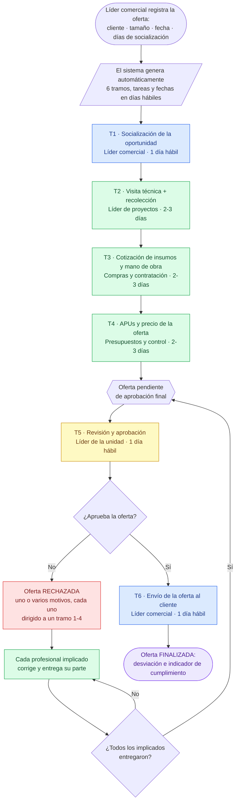
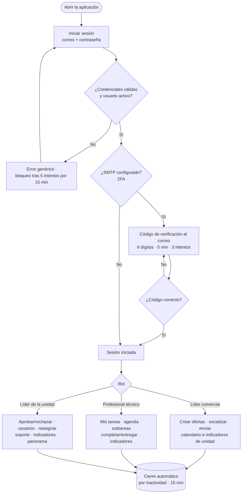
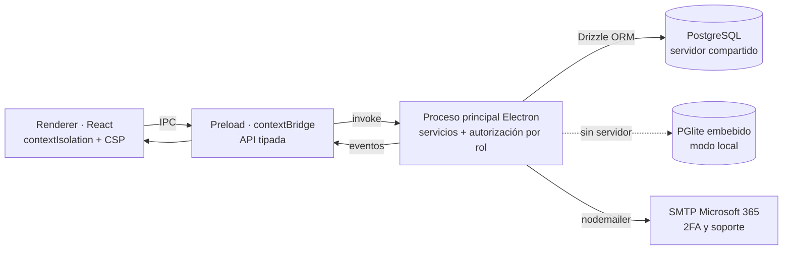

# Flujograma — Gestor de Ofertas

Documento solicitado por el Departamento de Tecnología. Los diagramas están en
**Mermaid**; se renderizan en VS Code (extensión Markdown Preview Mermaid),
GitHub, https://mermaid.live o draw.io. El diagrama principal también está como
archivo independiente: `flujograma_aplicacion.mermaid`.

---

## 1. Ciclo de vida de una oferta (flujo principal)

Flujo **secuencial de 6 tramos** entre 5 roles. Cada oferta avanza tramo a
tramo; al cerrarse cada uno se calcula su desviación e indicador, se reprograman
en cascada las fechas siguientes y se notifica al siguiente responsable.

**Reglas clave del flujo**
- Los plazos se calculan en **días hábiles** (excluye fines de semana y festivos
  de Colombia). Tamaño grande = 9 días técnicos (3-3-3); pequeña = 6 (2-2-2).
  Socialización, aprobación y envío suman 1 día cada uno, aparte.
- Un retraso en un tramo **desplaza** las fechas siguientes pero **no penaliza**
  la calificación del profesional posterior (cada quien se mide contra su propia
  duración desde que recibe el trabajo).
- El **tiempo de corrección** tras un rechazo se contabiliza aparte y no afecta
  la calificación de los tramos ya entregados.
- La oferta se mide contra la **fecha comprometida con el cliente** (la del
  envío) al completarse el tramo 6.

## 2. Inicio de sesión y acceso por rol

## 3. Arquitectura (flujo técnico de datos)

> Toda la **lógica de negocio y la autorización** se ejecutan en el proceso
> principal; la interfaz solo consume una API tipada por `contextBridge`. La base
> de datos es PostgreSQL (servidor compartido) o PGlite embebido (local), con el
> mismo dialecto.
