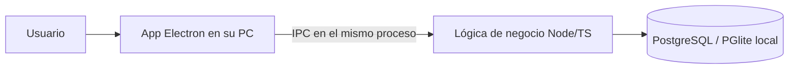
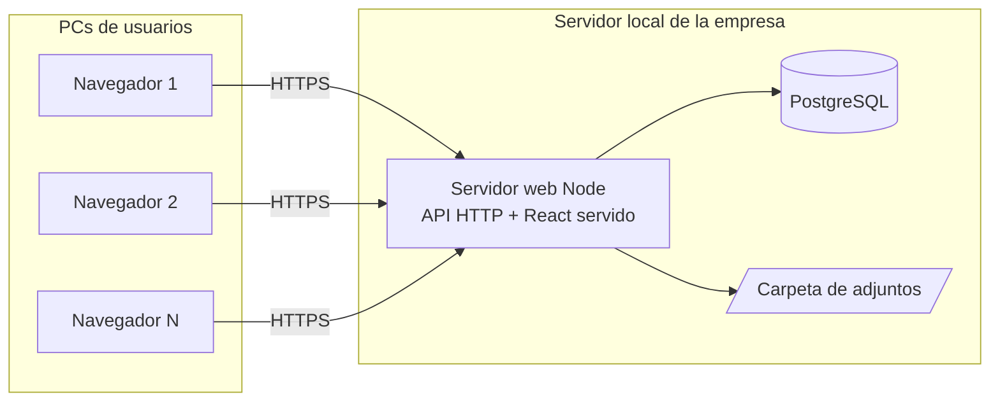

# Plan de migración a aplicación web
## Gestor de Ofertas — de escritorio (Electron) a web en servidor

**Fecha:** 3 de julio de 2026
**Versión del plan:** 1.2
**Estado:** Aprobado por Tecnología — objetivo de despliegue: **Vercel + Supabase**

> **Actualización v1.2 — objetivo de despliegue en la nube (Vercel + Supabase).**
> Tecnología decidió desplegar en la nube usando **Supabase** (PostgreSQL +
> autenticación + almacenamiento) y **Vercel** (frontend React + backend
> serverless), ambos en plan **Pro**. Cambios respecto a v1.1:
> - **Base de datos:** PostgreSQL gestionado por **Supabase** (antes: servidor
>   local). El código casi no cambia (ya es PostgreSQL); solo la cadena de conexión.
> - **Autenticación:** **Supabase Auth** (antes: JWT propio). Facilita el SSO con
>   Entra ID. El backend valida el token de Supabase y cruza el correo con la
>   tabla `usuario` para el rol.
> - **Archivos adjuntos:** **Supabase Storage** (antes: carpeta en el servidor;
>   el modo serverless de Vercel no tiene disco propio).
> - **Backend:** se adapta a **funciones serverless** de Vercel (reutiliza la
>   misma app Express). El barrido de alertas pasa a un **Vercel Cron**.
> - Guía operativa paso a paso en **`MANUAL_DESPLIEGUE.md`**.

---

## 1. Objetivo

Publicar el **Gestor de Ofertas** como **aplicación web**, accesible desde el
navegador de cada usuario contra un **servidor local** de la empresa, **sin
reescribir la lógica de negocio** ya construida y probada.

La estrategia acordada con Tecnología es **reemplazar únicamente la capa de
escritorio (Electron)** por un servidor web, conservando:

- **React** para la interfaz (ya es tecnología web),
- **Node.js + TypeScript** para la lógica de negocio (ya es tecnología de servidor),
- **PostgreSQL** como base de datos (alojada en el servidor local).

Con esto se reutiliza aproximadamente el **70–80 %** del código actual y se
evita una reescritura completa (p. ej. a PHP), que habría descartado los 21
módulos de negocio y las 122 pruebas automatizadas existentes.

---

## 2. Arquitectura: antes y después

### Antes (escritorio)

Cada PC ejecuta su propia copia; la sesión vive dentro del proceso de Electron.

### Después (web en servidor local)

Un solo servidor atiende a todos por HTTP; cada petición lleva la identidad del
usuario (token/sesión) y se autoriza por rol en el backend.

---

## 3. Alcance

### Se conserva (reutilización)
- Toda la **lógica de negocio**: días hábiles, flujo de 6 tramos, indicadores,
  reglas RN-15/RN-19, reasignación, subtareas, correcciones, soporte.
- Los **componentes React** de la interfaz.
- El **esquema de PostgreSQL** y el acceso vía Drizzle ORM.
- La **seguridad** ya implementada: hash bcrypt, política de contraseñas,
  bloqueo de cuenta, código 2FA por correo.

### Se reemplaza / se agrega
- **Electron, preload/contextBridge y el empaque `.exe`** → se retiran.
- **Capa API HTTP** (Node + Express/Fastify) que expone la lógica existente.
- **Sesiones web** con token (JWT) o cookie de sesión, y middleware de rol.
- **Convención de códigos HTTP** y manejo centralizado de errores.
- **Cliente HTTP** en el frontend (reemplaza las llamadas IPC `window.api`).
- **Subida/descarga de archivos** por HTTP (adjuntos y pantallazos).
- **Configuración por variables de entorno** (`.env`) para el despliegue.

### Fuera de alcance (salvo que se apruebe aparte)
- Migración a nube pública (Azure). *No requiere cambios de código: solo cambia
  la URL de conexión y el dominio; puede hacerse después sin reescritura.*

> **Nota:** el login con **Microsoft Entra ID / SSO corporativo** (que en la
> versión 1.0 se propuso como fase posterior) **quedó incluido en esta entrega**
> por decisión de Tecnología. Ver Fase 6 (ahora comprometida, no opcional).

---

## 4. Cómo este plan cubre lo solicitado por Tecnología

| Solicitud original de Tecnología | Cómo se cubre en este plan |
|---|---|
| Cadena de conexión y variables de entorno | Fase 5 — configuración por `.env`, ya soportado (`GESTOR_DB_URL`) |
| Servidor escuchando en la red (no solo localhost) | Fase 1 — servidor Node HTTP en el servidor local, accesible en la LAN |
| Multiusuario y control de sesiones (tokens/JWT) | Fase 2 — login con token + autorización por rol en cada petición |
| Aislamiento de datos por rol | Fase 2 — reutiliza la autorización por rol ya existente y probada |
| Almacenamiento de archivos en el servidor | Fase 4 — carpeta controlada en el servidor (o `bytea` en BD) |
| Manejo de errores por códigos HTTP (200/400/404/500) | Fase 1 — convención de códigos y manejador central de errores |
| Base de datos PostgreSQL en el servidor local | Fase 5 — despliegue con PostgreSQL en el servidor |

---

## 5. Plan por fases

> Estimación en días de trabajo dedicado de desarrollo. Son rangos, no
> compromisos contractuales; dependen de la disponibilidad y de imprevistos de
> integración con la infraestructura.

### Fase 0 — Preparación e infraestructura *(responsable: Tecnología)*
**Objetivo:** dejar listo el entorno para desplegar y probar.
- Servidor local con **Node.js LTS** (v20+) y **PostgreSQL** (v14+) instalados.
- Base de datos `gestor_ofertas` + usuario con permisos.
- Red: puerto del servidor web abierto en la LAN; **HTTPS** (certificado, puede
  ser interno).
- (Opcional) buzón **SMTP de Microsoft 365** para 2FA y correos de soporte.
- **Registro de la aplicación en Azure (Entra ID App Registration)** y entrega
  de *Tenant ID, Client ID, Client Secret y Redirect URI* por canal seguro
  (necesario para Fase 6).
- **Decisiones cerradas** (ver sección 8).

**Entregable:** servidor accesible y credenciales entregadas por canal seguro.
**Estimación:** en paralelo (Tecnología).

### Fase 1 — Backend HTTP (API)
**Objetivo:** exponer la lógica de negocio existente como API web.
- Montar servidor **Node + Express/Fastify** con estructura de rutas.
- Convertir cada operación IPC actual en un **endpoint HTTP** que llama a los
  servicios ya existentes (sin reescribir la lógica).
- **Convención de códigos HTTP** (200 OK, 201, 400 datos inválidos, 401 no
  autenticado, 403 sin permiso, 404 no encontrado, 500 error del servidor) y
  **manejador de errores centralizado**.
- Validación de entrada en el borde de la API.

**Entregable:** API funcional probada con las reglas de negocio actuales.
**Criterio de aceptación:** las pruebas de los servicios siguen pasando y los
endpoints responden con los códigos correctos.
**Estimación:** 5–8 días.

### Fase 2 — Autenticación y sesiones web
**Objetivo:** identificar a cada usuario en cada petición y autorizar por rol.
- Endpoint de **login** que valida credenciales (reutiliza bcrypt) y emite un
  **token JWT**.
- **Middleware** que valida el token y **autoriza por rol** en cada endpoint
  (reutiliza las reglas de autorización ya probadas).
- Reutilizar **bloqueo de cuenta** y **2FA por correo** existentes.
- **Expiración del token** reemplaza el cierre por inactividad de escritorio.

**Entregable:** flujo de login web + protección de todos los endpoints.
**Criterio de aceptación:** un usuario solo accede a lo que su rol permite;
credenciales inválidas y sesiones vencidas responden 401/403.
**Estimación:** 4–6 días.

### Fase 3 — Frontend web (SPA)
**Objetivo:** servir la misma interfaz React en el navegador.
- Retirar **Electron** y el **preload**; eliminar dependencia de `window.api`.
- **Cliente HTTP** (fetch) que consume la API, con manejo de token y de errores.
- **Pantalla de login** y guardado seguro del token/sesión.
- Compilar React como **SPA** servida por el servidor Node (o estáticos).

**Entregable:** aplicación navegable en el navegador con todas las vistas
actuales.
**Criterio de aceptación:** los flujos actuales (crear oferta, gestionar
tramos, indicadores, notificaciones, soporte) funcionan desde el navegador.
**Estimación:** 5–8 días.

### Fase 4 — Archivos (adjuntos y pantallazos)
**Objetivo:** que los archivos funcionen entre usuarios en el servidor.
- **Subida** por HTTP (multipart) y almacenamiento en **carpeta controlada del
  servidor** (recomendado) o en **PostgreSQL (`bytea`)**.
- **Descarga autorizada** (solo participantes de la oferta / rol correspondiente).

**Entregable:** adjuntos y pantallazos de soporte accesibles para todos.
**Criterio de aceptación:** un usuario sube un archivo y otro autorizado lo abre
desde su PC.
**Estimación:** 2–3 días.

### Fase 5 — Despliegue y pruebas en el servidor
**Objetivo:** dejar el sistema corriendo y verificado en el servidor local.
- **Configuración por `.env`** (conexión a BD, SMTP, secretos de token).
- Servir **API + SPA** detrás de **HTTPS**.
- **Pruebas** de integración, de roles y de carga básica con varios usuarios
  concurrentes; verificación de tráfico y códigos de respuesta.
- Datos iniciales (usuario administrador, festivos) y guía de operación.

**Entregable:** aplicación en producción en el servidor local + manual de
despliegue.
**Criterio de aceptación:** varios usuarios concurrentes operan sin conflictos;
respaldos de BD verificados.
**Estimación:** 3–5 días.

### Fase 6 — Login con Microsoft Entra ID (SSO) *(comprometida)*
**Objetivo:** iniciar sesión con la cuenta corporativa.
- Integración con **Entra ID** (requiere el registro de la aplicación en Azure
  de la Fase 0).
- **Convive con el login propio actual** durante la transición (respaldo del
  administrador).

**Entregable:** inicio de sesión corporativo.
**Criterio de aceptación:** un usuario entra con su cuenta corporativa y se le
asigna su rol en el sistema.
**Estimación:** 5–7 días. *(Puede desarrollarse en paralelo a las Fases 3–5;
depende de que Tecnología entregue el App Registration.)*

---

## 6. Resumen de estimación

| Fase | Trabajo | Estimación |
|---|---|---|
| 0 | Infraestructura (Tecnología) | En paralelo |
| 1 | Backend HTTP (API) | 5–8 días |
| 2 | Autenticación y sesiones | 4–6 días |
| 3 | Frontend web (SPA) | 5–8 días |
| 4 | Archivos | 2–3 días |
| 5 | Despliegue y pruebas | 3–5 días |
| 6 | Entra ID (SSO) — comprometida | 5–7 días |
| **Total (Fases 1–6)** | **Salida a producción** | **~5–7 semanas** |

---

## 7. Responsabilidades

| Actividad | Responsable |
|---|---|
| Desarrollo (Fases 1–5) | Desarrollo (este proyecto) |
| Servidor, PostgreSQL, red, HTTPS, respaldos | Tecnología |
| Buzón SMTP M365 / registro Entra ID | Tecnología |
| Aprobación del alcance y de las decisiones abiertas | Tecnología + Dueño del proceso |

---

## 8. Decisiones cerradas

| Decisión | Resolución |
|---|---|
| **Plataforma de despliegue** | **Vercel** (frontend + backend serverless) + **Supabase** (BD + Auth + Storage), ambos **Pro** |
| **Base de datos** | **Supabase PostgreSQL** (nube), conexión por el *pooler* |
| **Autenticación** | **Supabase Auth** (con Entra ID como proveedor en Fase 6) |
| **Almacenamiento de archivos** | **Supabase Storage** (bucket `adjuntos`) |
| **Login con Entra ID** | **Incluido en esta entrega** (Fase 6, comprometida) |

---

## 9. Riesgos y mitigaciones

| Riesgo | Mitigación |
|---|---|
| Concurrencia de varios usuarios sobre los mismos datos | PostgreSQL con transacciones; ya soportado |
| Exposición del servidor en la red | HTTPS + servidor solo en la LAN; usuario de BD de mínimo privilegio |
| Pérdida de archivos adjuntos | Respaldo de la carpeta/BD en la rutina de backups del servidor |
| Rotación de secretos (token, BD) | Secretos en `.env` fuera del código, con ACL en el servidor |
| Alcance ampliándose (SSO, nube pública) durante el proyecto | Quedan como fases separadas y aprobadas aparte |

---

## 10. Estado de aprobación

- ✅ **Alcance aprobado por Tecnología** (Fases 1–6).
- ✅ **Decisiones cerradas** (sección 8).
- ⏳ **Pendiente de Tecnología (Fase 0, en paralelo):** servidor con Node +
  PostgreSQL, red/HTTPS, y el **App Registration de Azure** para Entra ID.

La **Fase 1 (backend HTTP)** no depende de la infraestructura y puede iniciarse
de inmediato; Tecnología prepara la Fase 0 en paralelo.
